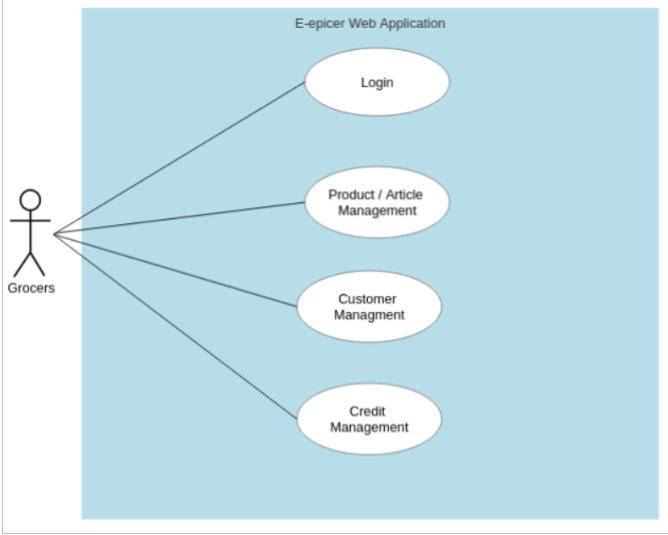
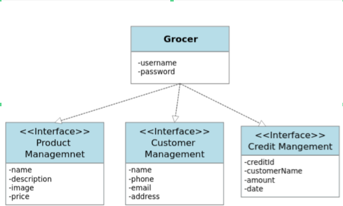
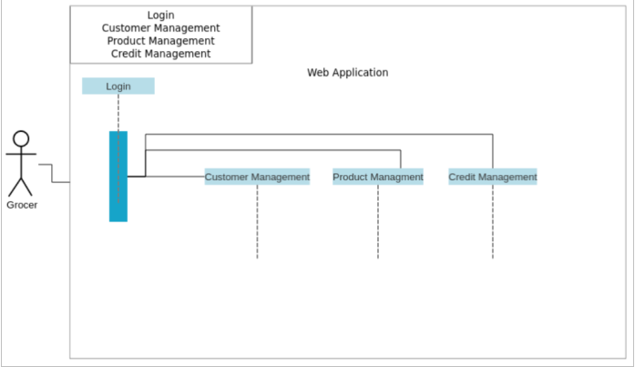
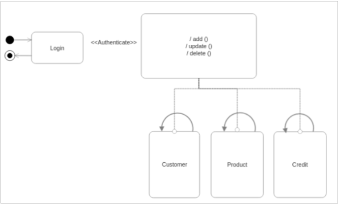

<div>
  
  
</div>

<br><br>
<br><br>
<br><br>
<br><br>

Created By: 
- Adil ghafir 
- Ayman aoufi
- Aissa berrouhou

Supervised By: 
- Mr. Lotfi EL AACHAK


# Store Management

## Description

This is a simple store management system. It is a web application created using the Django framework. It is a simple application that allows you to add, edit, delete and view products, customers. It also allows you to manage payments and customer credits.
[here](./diagrams/uni_logo.jpeg)
## Installation
Make sure you have Python 3.6 or higher installed on your computer. You can download it from [here](https://www.python.org/downloads/).

Clone the repository to your computer.

```bash
git clone https://github.com/aiissaa/store-management.git
```

Navigate to the project directory.

```bash
cd store-management
```

Create a virtual environment.

```bash
python3 -m venv venv
```

Activate the virtual environment.

For Linux and Mac

```bash
source venv/bin/activate
```

For Windows

```bash
venv\Scripts\activate
```

Install the project dependencies.

```bash
pip install -r requirements.txt
```

## Database
The application uses a MySQL database. You can download it from [here](https://dev.mysql.com/downloads/mysql/).

Open the MySQL command line client.
```bash
mysql -u root -p
```
Create a database named `store_management`.

```bash
CREATE DATABASE store_management;
```

Create a user named `store_management` with password `5;UoHXBQJ0Du9bL`.

```bash
CREATE USER 'store_management'@'localhost' IDENTIFIED BY '5;UoHXBQJ0Du9bL';
```

Grant all privileges to the user on the database.

```bash
GRANT ALL PRIVILEGES ON store_management.* TO 'store_management'@'localhost';
```

## Migrations
Run the following commands to create the database tables.

```bash
python manage.py makemigrations
```
```bash
python manage.py migrate
```

## Run the application
Run the following command to start the application.

```bash
python manage.py runserver
```

## Usage
Create a superuser account.

```bash
python manage.py createsuperuser
```

Login to the admin panel using the superuser account you created.

# Why did we create this application?
Based on the description provided, the problem this web application is designed to solve is the need for grocers to efficiently manage their customer's credits. This may include issues such as:
- **Inefficient credit management**: Grocers may currently be using manual or outdated systems to manage their customer's credits, leading to errors or delays in processing credits or refunds.
- **Lack of customer management**: Without an effective system for managing customer information, grocers may struggle to keep track of customer credits or provide a personalized experience for their customers.
- **Poor product article management**: Without an efficient way to manage product articles, grocers may struggle to accurately track inventory levels or pricing, leading to potential issues with credits or refunds.
- **Security concerns**: Given the sensitive nature of customer credit information, the web application must have robust login and password authentication to prevent unauthorized access to the system.
Overall, this web application is designed to address the above problems and improve the grocer's ability to manage customer credits efficiently and securely.


### :hammer_and_wrench: Development Tools

<br>
<div align="center">
  &nbsp;
  &nbsp;
  &nbsp;
  &nbsp;
  &nbsp;
  &nbsp;
  &nbsp;
  &nbsp;
  &nbsp;
  &nbsp;
</div>
<br>

# UML Modeling

**Use Case Diagram**



**Class Diagrams:**



**Sequence Diagram**



**State Diagram:**



